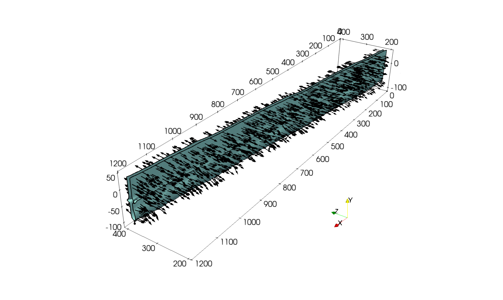
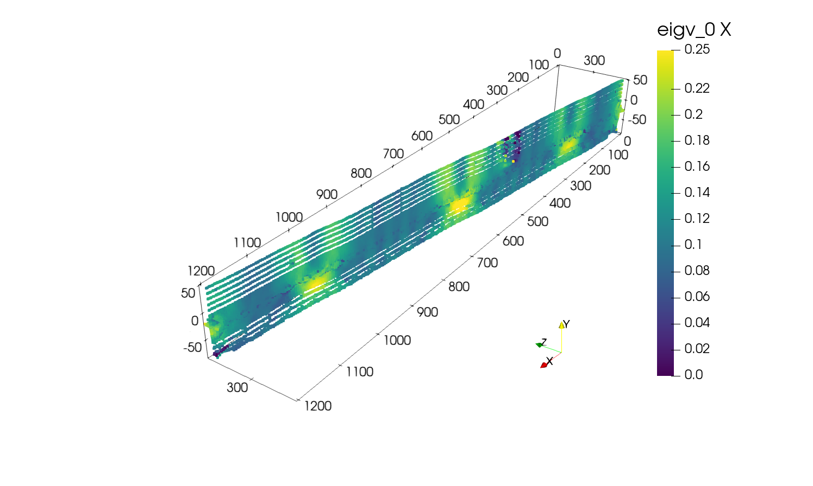
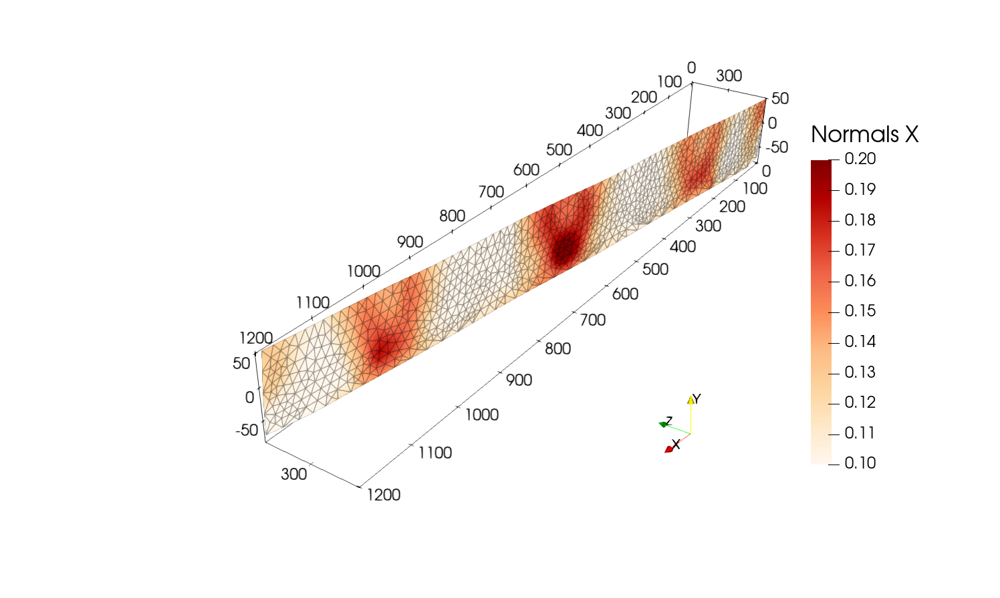

Single vertical fault example
==============================

The following example shows how to extract and mesh a fault from a 3D model.
The file to follow the example can be found in the data folder of the 
repository under the name ``mesh.vts``.

This file is a subsampled version of the example provided in the article 
`3D reconstruction of complex fault systems from volumetric geodynamic shear zones using medial axis transform`. 

You can familiarize yourself with the mesh by loading it in Paraview.

.. image:: figures/e2_mesh.png
  :width: 400
  :align: center

Step 1: Extrude mesh vertically
-------------------------------
This step is optional, but working with extruded meshes can be easier to extract faults.
In this example we will extrude the surface of the mesh in the :math:`y` direction, 
but note that this process can be done in any of the three directions.

To do so we will use a YAML file with the following content:

.. code-block:: yaml

    model: 
      file: "data/mesh.vts"
      output: "data/extruded.vts"
      fields: ["e2"]
      e2_key: "e2"

    extrusion:
      - name: "ymax"
        nsteps: 5
        dx: 1.0e4

The block ``model`` specifies the input mesh file, the output file, 
and optionally the fields to be extruded and the key of the strain-rate second invariant field.
The ``extrusion`` block specifies the extrusion parameters. 
In this case, we are extruding the mesh in the :math:`y` direction starting from the top boundary,
with 5 steps and a step size of 10 km.
Additional extrusion can be done in the :math:`x` and :math:`z` directions 
by adding them to list such that:

.. code-block:: yaml

    extrusion:
      - name: "ymax"
        nsteps: 5
        dx: 1.0e4
      - name: "ymin"
        nsteps: 3
        dx: 5.0e4
      - name: "xmax"
        nsteps: 1
        dx: 1.0e4
      - name: "xmin"
        nsteps: 2
        dx: 2.0e4
      - name: "zmax"
        nsteps: 1
        dx: 1.0e4
      - name: "zmin"
        nsteps: 1
        dx: 1.0e4

Then, the extrusion can be performed by running:

.. code-block:: bash

    $ python scripts/mesh_extrude.py -f path/to/yaml/file/extrusion.yaml

After this step, you should obtain a new mesh file ``extruded.vts`` in the data folder.

Step 2: Extract shear zone envelope
------------------------------------
This step consists of obtaining the envelope of the shear zone.
Using Paraview, load the extruded mesh (or the original mesh if no extrusion was performed) using 
``file -> open -> data/extruded.vts``.

Step 2.1: Compute the field ``xi``
~~~~~~~~~~~~~~~~~~~~~~~~~~~~~~~~~~
If you provided the ``e2_key`` in the YAML file used for the extrusion, you should have a new field named ``xi`` 
on the mesh.
If you need to calculate it again or if you are working with the original mesh, use the ``Calculator`` filter
to apply the following expression:

.. math::

    \xi = \exp(\log_{10} (e_2) - \min(\log_{10} (e_2)) ).

Step 2.2: Convert cell data to point data
~~~~~~~~~~~~~~~~~~~~~~~~~~~~~~~~~~~~~~~~~~
The strain-rate and thus the new field ``xi`` are, in our case, defined as cell data.
To extract the envelope of the shear zone, we will first need to convert the cell data to point data using
``Filters -> Cell Data to Point Data``.

You should obtain the following:

.. image:: figures/xi_mesh.png
  :width: 800
  :align: center

Step 2.3: Extract the envelope
~~~~~~~~~~~~~~~~~~~~~~~~~~~~~~~
Once the field is converted to point data, apply ``Filters -> Contour`` to the mesh and set the contour value to
``11`` on the ``xi`` field.
You can play with that contouring value to see how it affects the envelope.

Step 2.4: Compute the normals
~~~~~~~~~~~~~~~~~~~~~~~~~~~~~
Next, it is required to get the **outward pointing normals** of each point of the envelope.
Depending on the Paraview version you execute, the normal vectors may have already been generated when 
applying the contour filter.

In any case you can generate them by applying the ``Filters -> Surface Normals`` or ``Filters -> Generate Surface Normals``
depending the Paraview version.
Ensure that the normals are pointing outwards by visualizing them with the ``Glyph`` filter.
If it is not the case, the normals can be inverted using the ``Flip normals`` option in the filter generating the normals.

Once done you should have the following:

Finally, save the envelope mesh using ``File -> Save Data`` and use a ``VTK`` like format.

.. note::
  
  During the saving process you can select the fields to save, in our case we only need the ``Normals`` field. 
  This functionality is particularly useful to save space disk when working with heavy data.

For the next step, we will assume that the file is saved as ``data/contour.vtk``.

Step 3: Compute the medial axis
-------------------------------
To compute the medial axis of the fault, we first define a YAML file with the following content:

.. code-block:: yaml

    contour_file: "data/contour.vtk"
    radius_ma: 1.0e4
    radius_cov: 8.0e3

The block ``contour_file`` specifies the input mesh file, if no ``output`` is provided, a default name is attributed
to not overwrite the contour file.

The ``radius_ma`` is the initial distance in distance units of the data contained in the file, here in metres, at which the medial axis computing algorithm starts. 
This value should always be greater than the width of the shear zone. 

The ``radius_cov`` is the radius of the sphere in which points are considered to compute 
the covariance matrix at each individual point.
In this example we will not use the covariance matrix analysis given the simplicity of the fault geometry.

Then, the medial axis can be computed by running:

.. code-block:: bash

    $ python scripts/get_medial_axis.py -f path/to/yaml/file/medial_axis.yaml

After this step, you should obtain a new mesh file in the data folder.
If you used the same naming convention as in the example, the file should be named ``data/contour_medial_axis.vtp``.

Step 4: Mesh the fault
----------------------

Step 4.1: Load the medial axis mesh
~~~~~~~~~~~~~~~~~~~~~~~~~~~~~~~~~~~
Start by loading the medial axis mesh in Paraview using ``file -> open -> data/contour_medial_axis.vtp``.
You should obtain the following:

Step 4.2: Delaunay triangulation
~~~~~~~~~~~~~~~~~~~~~~~~~~~~~~~~
Next, apply the ``Filters -> Delaunay 2D`` to the medial axis points set.
You can play with the ``Projection Plane Mode`` and the ``Tolerance`` to see how it affects the mesh.
In this example we will use ``XY Plane`` and a tolerance of ``1.0e-2``.

Step 4.3: Smooth the mesh
~~~~~~~~~~~~~~~~~~~~~~~~~
Once done, we will apply ``Filters -> Smooth`` to the mesh to obtain a smoother fault representation.
Again, you can play with the number of iterations to see how it affects the mesh.
In this example we will use ``500`` iterations.
After smoothing, you can apply ``Filters -> Subdivide`` to increase the number of mesh points 
and obtain a finer mesh that can be smoothed again etc...

After using a first smoothing with ``500`` iterations, followed by a subdivision and another smoothing with ``500`` iterations 
you should obtain the following:

Finally, save the fault mesh using ``File -> Save Data`` to the desired format.

To go further
-------------
Note that once the fault mesh is obtained, normals can be computed using the ``Filters -> Surface Normals`` and 
with further processing, we can interpolate val ues from the original mesh to the fault mesh to get 
the stress on fault, the slip rate, etc...

In this example, we processed a model with a single vertical fault, but the same process can be applied to
more complex fault geometries.