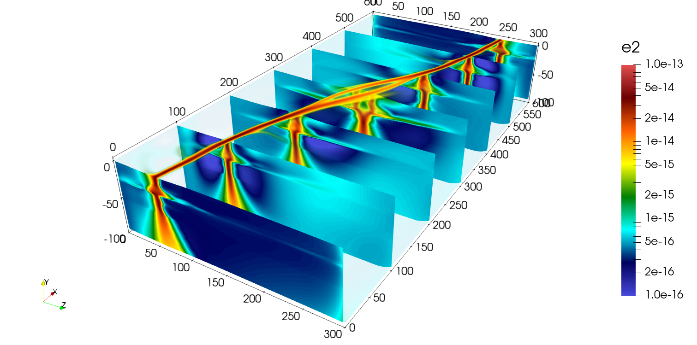
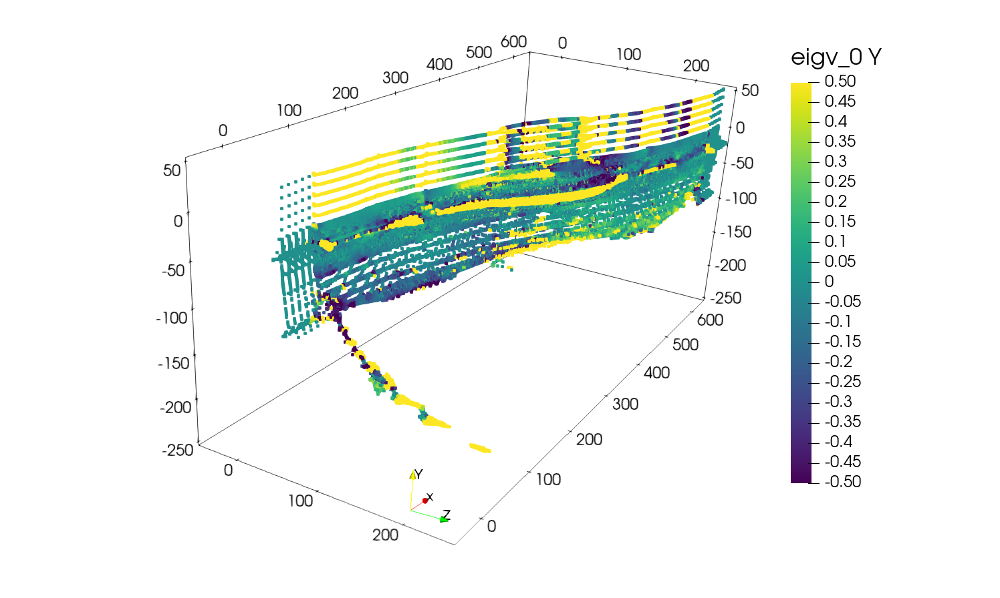
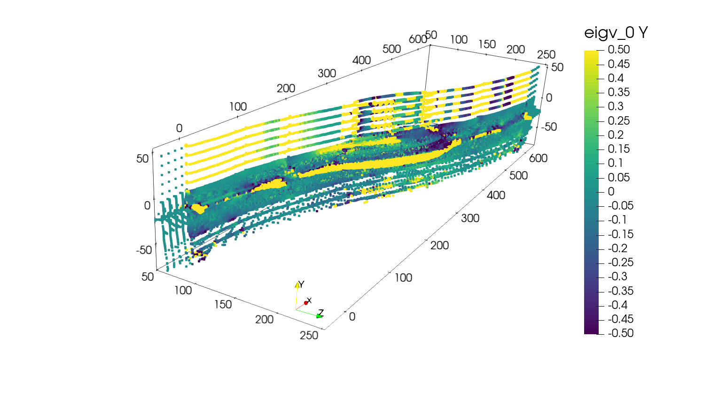
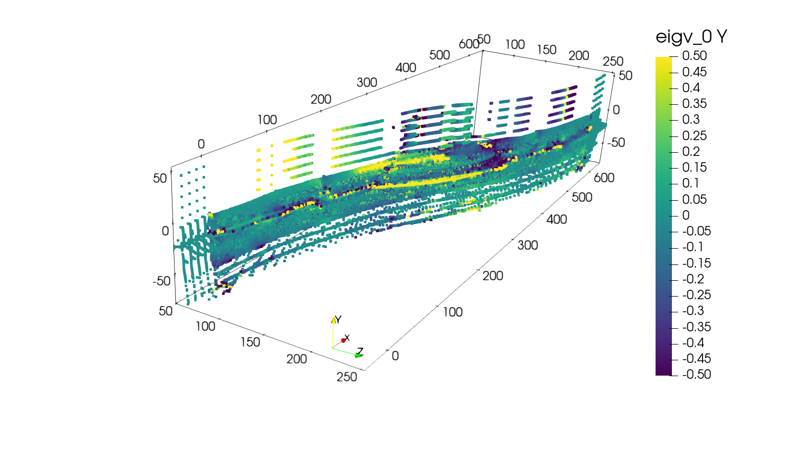
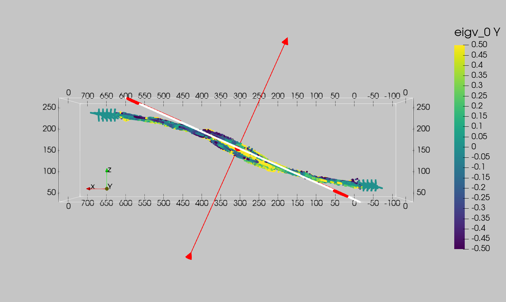
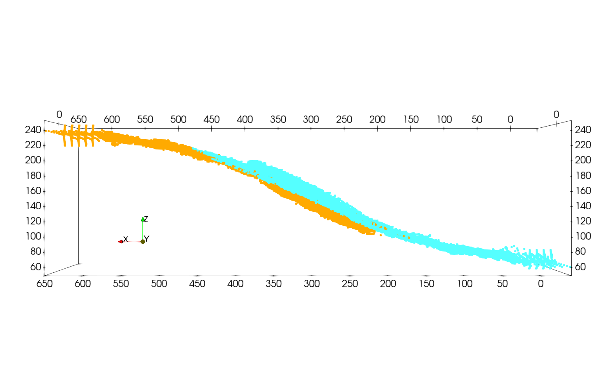
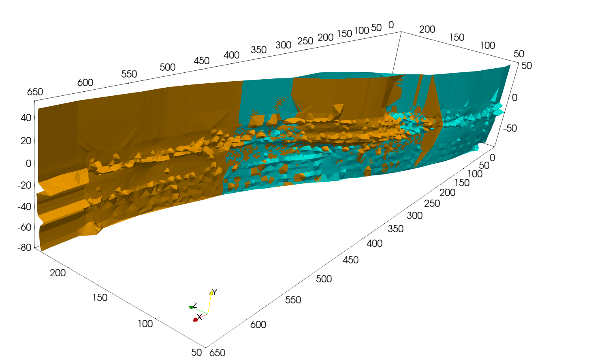
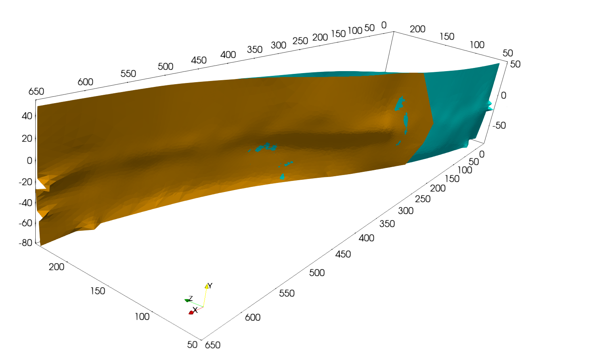
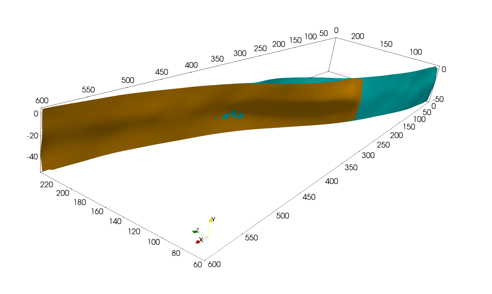

Restraining bend example
========================

The following example shows how to extract and mesh two faults interacting from a 3D model.
The purpose of this example is to show how we can make use of the covariance matrix eigenvectors to remove some points from the medial axis point set and how to split it into subsets to individualize faults.

The file can be found in this `repository`_ and is the same as the one used for the restraining bend model in the article |paper-title|.

We will start directly from the medial axis obtained with the following YAML file. For a more interactive example, see the :ref:`Single fault example <Single-fault-example>`.

.. code-block:: yaml

    model:
      file: "Models/restraining_bend-cellfields-e2.vts"  
      output: "Faults_output"  
      fields: ["e2","xi"]
      e2_key: "e2"

    extrusion:
      - name: "ymax"
        nsteps: 5
        dx: 1.0e4
      - name: "xmax"
        nsteps: 5
        dx: 1.0e4
      - name: "xmin"
        nsteps: 5
        dx: 1.0e4

    contour:
      flip_normals: false
      isovalue: 0.7
      field_name: "xi"

    medial_axis:
      radius_ma: 1e6
      get_eigv_cov: true
      radius_cov: 8000.0

Using this YAML file, we can directly obtain the extruded mesh, the contour and the medial axis in the output folder using

.. code-block:: bash

    $ python scripts/get_medial_axis.py -f path/to/yaml/file.yaml

Step 1: Subsample the medial axis
---------------------------------
On Paraview, open the medial axis file using ``file -> open -> Faults_output/restraining_bend-cellfields-ma.vtp``.
If you display the field ``eigv_0`` and its ``Y`` component you should obtain the following:

Contrarily to the :ref:`Single fault example <Single-fault-example>`, this model contains two faults interacting. 
Therefore, before meshing the fault surface we need to split the medial axis into two subsets.
In addition we can see that the medial axis point cloud extends to -200 km in the :math:`y` direction which is clearly too deep for a fault and that it flattens near the Moho because of ductile deformation.

Therefore, we will start by removing the points that are deeper than -80 km by using Paraview's ``Filters -> Clip`` using a clip type ``Box`` with the parameters ``Position = [-50e3, -80e3, -50e3]`` and ``Length = [700e3, 135e3, 310e3]``.
You should obtain the following:

Then, we will remove the points constituting the flat parts of the medial axis using ``Filters -> Threshold`` on the scalar field ``eigv_0`` and component ``Y``. 
By setting the ``lower threshold`` to ``-0.8`` and the ``upper threshold`` to ``0.8`` you should obtain the following:

Step 2: Split the medial axis
------------------------------
Now that we have removed the unwanted points, we will split the medial axis into two subsets representing the two faults.
To do so, we will use the ``Filters -> Clip`` with a clip type ``Plane``.

2.1. Clip the first fault
~~~~~~~~~~~~~~~~~~~~~~~~~
For the first fault, we will set

- ``Origin = [302387.67032763775, -13307.810077180751, 157019.16522767508]``
- ``Normal = [-0.4079877008277339, 0, 0.9129874237760889]``

The plane should look like this:

Apply the clip.

2.2. Clip the second fault
~~~~~~~~~~~~~~~~~~~~~~~~~~
Starting from the last ``Threshold`` filter, we will apply a second ``Clip`` filter with the following parameters:

- ``Origin = [306564.330654226, -13307.810077180751, 147672.71104823978]``
- ``Normal = [-0.4079877008277339, 0, 0.9129874237760889]``

And uncheck the option ``Invert`` to keep the points on the opposite side of the plane than for the previous clip.

.. warning:: 
  Make sure to apply the clips on the previously ``Threshold`` filtered points and not on the previous ``Clip`` or original points set.

Once the two points subsets have been separated you can color them using a different solid color for each subset and obtain a representation like this:

.. note::
  It is normal to have overlaps between the two subsets. This will ensure that the faults touch each other.

Step 3: Mesh the faults
-----------------------
Now that we have two subsets corresponding to the two branches of the restraining bend, we can mesh them.
To do so we will apply the ``Filters -> Delaunay2D`` filter to each subset with the following parameters:

- ``Projection Plane Mode = XY Plane``
- ``Tolerance = 5.0e-3``
  
Applying this filter to the two subsets should give you the following meshes:

Step 4: Smooth the meshes
-------------------------
Next we will apply Laplacian smoothing using ``Filters -> Smooth`` to the meshes to obtain a smoother fault representation.
Using a ``Number of iterations = 1000`` should result in the following meshes:

Finally you can apply another ``Filters -> Clip`` to remove the extruded and the deepest parts of the meshed surface if needed to obtain the following fault representation:

