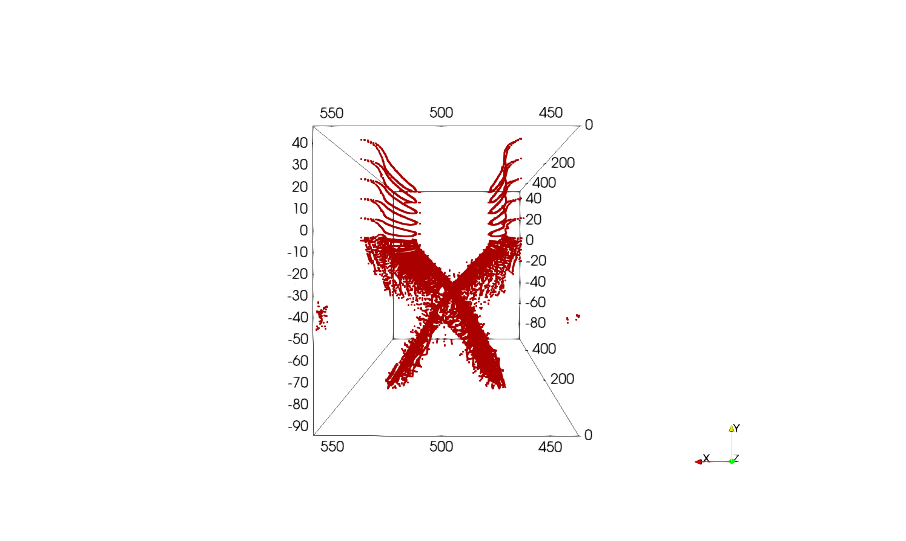
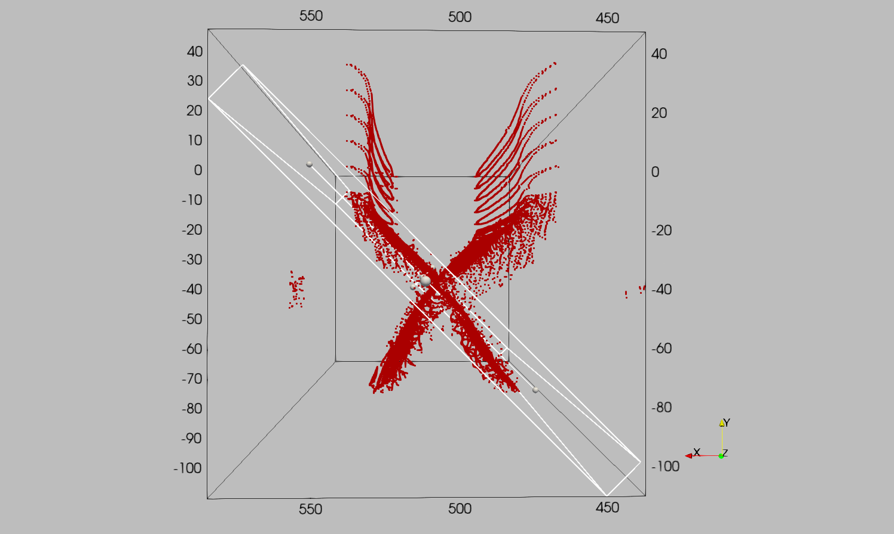

Rift example
============

The following example shows how to extract and mesh two faults interacting from a 3D model.
The purpose of this example is to show how we can make use of implicit clip functions to remove some points from the medial axis point set and how to split it into subsets to individualize faults.

The file can be found in this `repository`_ and is the same as the one used for the rift model in the article |paper-title|.

We will start directly from the medial axis obtained with the following YAML file. For a more interactive example, see the :ref:`Single fault example <Single-fault-example>`.

To generate the medial axis we will use the following YAML file:

.. code-block:: yaml

  model:
    file: "Models/rift-cellfields-e2.vts"
    output: "Faults_output"
    fields: ["e2","xi"]
    e2_key: "e2"

  extrusion:
    - name: "ymax"
      nsteps: 5
      dx: 1.0e4

  contour:
    flip_normals: false
    isovalue: 0.85
    field_name: "xi"

  medial_axis:
    radius_ma: 1e4
    pca_method: "sphere"
    radius_cov: 25000.0

Using this YAML file, we can directly obtain the extruded mesh, the contour and the medial axis in the output folder using

.. code-block:: bash

    $ python scripts/get_medial_axis.py -f path/to/yaml/file.yaml

Clip the medial axis
--------------------
On Paraview, open the medial axis file using ``file -> open -> Faults_output/rift-cellfields-ma.vtp``.
You should have the following:

We can clearly identify two faults. To individualize them, we will use ``Filters -> Clip`` with clip type ``Box``.

First fault
~~~~~~~~~~~
For this ``Filters -> Clip`` with clip type ``Box`` we will use the following parameters:

- ``Position = [541786.3644705944, -98752.6446342942, 16828.67291570746]``
- ``Rotation = [0, 0, 45]``
- ``Length   = [14780.166362142543, 126307.84710639693, 512491.1482486307]``

The clip box should look like this:

Apply the clip and move to the second fault.

Second fault
~~~~~~~~~~~~
On the **Original medial axis point set** we use ``Filters -> Clip`` with clip type ``Box`` and the following parameters:

- ``Position = [438705.88734516234, -98152.16976027744, -1652.6986957568442]``
- ``Rotation = [0, 0, -45]``
- ``Length   = [16268.797325981977, 189668.6824818554, 512491.14824863104]``

The clip box should look like this:

Apply the clip.

Mesh the faults
---------------
Now that we have two separate medial axis point sets, we can mesh them.
The two individualized subsets should look like this:

To mesh the faults we will use the ``Filters -> Delaunay 2D`` with the parameters:

- ``Projection Plane Mode = Best-Fitting Plane``
- ``Tolerance = 1.0e-2``
  
The two meshed faults should look like this:

Smooth the meshes
-----------------
The obtained Delaunay meshes are rough, therefore we apply them Laplacian smoothing using ``Filters -> Smooth`` with ``Number of Iterations = 1000``. Using this filter on both meshes should give you the following result:

